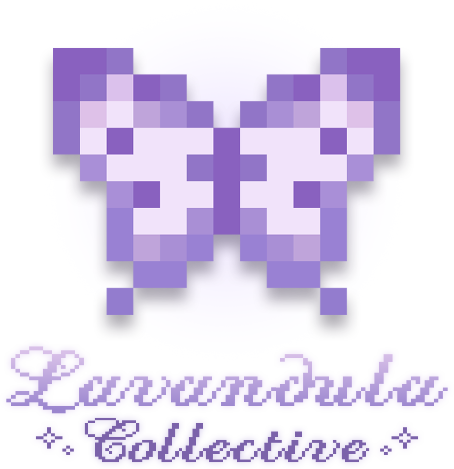
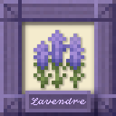
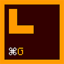

# Home

<figure><figcaption></figcaption></figure>

<strong>· · ──── ·✶· ──── · ·</strong>

<h4 align="center"><em><mark style="color:$primary;">Crafting worlds worth coming home to.</mark></em></h4>

Explore our Minecraft mods, modpacks, and more!

<a href="https://app.gitbook.com/o/su6DYrYGIoNVvHpiBlzo/s/VAqd8KuLEIUsMxWajGvY/" class="button primary" data-icon="box-isometric-tape">See Projects</a><a href="https://app.gitbook.com/o/su6DYrYGIoNVvHpiBlzo/s/Ps3HEspLtmNd5qRF51jU/" class="button secondary" data-icon="book-heart">Documentation</a><a href="license.md" class="button secondary" data-icon="copyright">License</a>

***

<h2 align="center">Our Projects</h2>

Discover our Minecraft mods, modpacks, and projects below!

<table data-card-wrap="false" data-view="cards" data-search="false"><thead><tr><th align="center"></th><th align="center"></th><th></th><th></th><th><select multiple><option value="Agb5TSHrDH8Y" label="1.21.1" color="blue"></option><option value="9nYd5gSlDTzA" label="1.20.1" color="blue"></option></select></th><th align="center"></th></tr></thead><tbody><tr><td align="center"><h3></h3><h3><strong>Lavendre</strong></h3></td><td align="center"><i class="fa-box-isometric-tape" style="color:$primary;">:box-isometric-tape:</i> <mark style="color:$primary;"><strong>Modpack</strong></mark></td><td>Built upon Mizuno's 16 Craft, Lavendre blends curated CIT packs, beautiful visuals, and thoughtful enhancements. Build, decorate, and feel at home!</td><td></td><td>1.21.1</td><td align="center"><a href="https://modrinth.com/modpack/lavendre/" class="button primary" data-icon="nfc-directional">Modrinth</a><a href="https://app.gitbook.com/o/su6DYrYGIoNVvHpiBlzo/s/6yE9zCPCeRnJhsby6njd/" class="button secondary" data-icon="book-heart">Docs</a></td></tr><tr><td align="center"><h3></h3><h3><strong>CITX</strong></h3></td><td align="center"><i class="fa-gear-code" style="color:$primary;">:gear-code:</i> <mark style="color:$primary;"><strong>Mod</strong></mark></td><td>A mod that allows easy renaming of CIT items with a custom command.</td><td></td><td>1.20.1, 1.21.1</td><td align="center"><a href="https://modrinth.com/mod/citx/" class="button primary" data-icon="nfc-directional">Modrinth</a><a href="https://app.gitbook.com/o/su6DYrYGIoNVvHpiBlzo/s/YFKPHjDb6bIm7gCTbAc3/" class="button secondary" data-icon="book-heart">Docs</a></td></tr><tr><td align="center">

<h3><strong>CITL</strong></h3></td><td align="center"><i class="fa-gear-code" style="color:$primary;">:gear-code:</i> <mark style="color:$primary;"><strong>Mod</strong></mark></td><td>A mod that provides an in-game menu for browsing installed OptiFine/CIT Resewn CIT packs.</td><td></td><td>1.21.1</td><td align="center"><h4><mark style="color:$primary;"><strong>Coming Soon...</strong></mark></h4></td></tr></tbody></table>

***

<h2 align="center"><mark style="color:$primary;">Meet the Lavenfolk</mark></h2>

Meet the community and keep up with what's happening around the Collective.

<a href="https://discord.gg/DXFpzAn2fh/" class="button primary" data-icon="discord">Join Discord</a><a href="https://github.com/Lavandula-Collective/" class="button secondary" data-icon="github">GitHub Organization</a>

***
