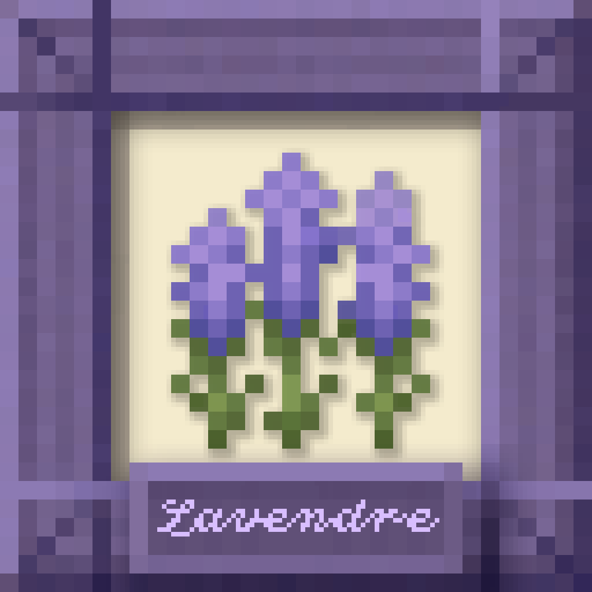
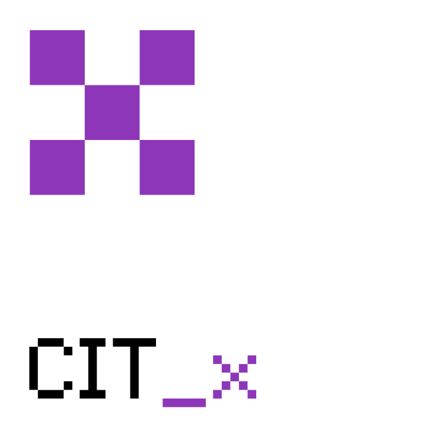

# Home

<figure><figcaption></figcaption></figure>

<strong>· · ──── ·✶· ──── · ·</strong>

<h4 align="center"><em><mark style="color:$primary;">Crafting worlds worth coming home to.</mark></em></h4>

Explore our Minecraft mods, modpacks, and more!

<a href="https://app.gitbook.com/o/su6DYrYGIoNVvHpiBlzo/s/VAqd8KuLEIUsMxWajGvY/" class="button primary" data-icon="box-isometric-tape">See Projects</a><a href="https://app.gitbook.com/o/su6DYrYGIoNVvHpiBlzo/s/Ps3HEspLtmNd5qRF51jU/" class="button secondary" data-icon="book-heart">Documentation</a><a href="license.md" class="button secondary" data-icon="copyright">License</a>

***

<h2 align="center">Our Projects</h2>

Discover our Minecraft mods, modpacks, and projects below!

<table data-card-wrap="false" data-view="cards" data-search="false"><thead><tr><th align="center"></th><th align="center"></th><th></th><th align="center"></th><th align="center"></th></tr></thead><tbody><tr><td align="center"><h3></h3><h3><strong>Lavendre</strong></h3></td><td align="center">
<i class="fa-box-isometric-tape" style="color:$primary;">:box-isometric-tape:</i>

<mark style="color:$primary;"><strong>Modpack</strong></mark>
</td><td>Built upon Mizuno's 16 Craft, Lavendre blends curated CIT packs, beautiful visuals, and thoughtful enhancements. Build, decorate, and feel at home!</td><td align="center"><a href="https://modrinth.com/modpack/lavendre/" class="button primary" data-icon="nfc-directional">Modrinth</a></td><td align="center"><a href="https://app.gitbook.com/o/su6DYrYGIoNVvHpiBlzo/s/Ps3HEspLtmNd5qRF51jU/" class="button secondary medium" data-icon="book-heart">Docs</a></td></tr><tr><td align="center"><h3></h3><h3><strong>CITX</strong></h3></td><td align="center">
<i class="fa-gear-code" style="color:$primary;">:gear-code:</i>

<mark style="color:$primary;"><strong>Mod</strong></mark>
</td><td></td><td align="center"></td><td align="center"></td></tr></tbody></table>
