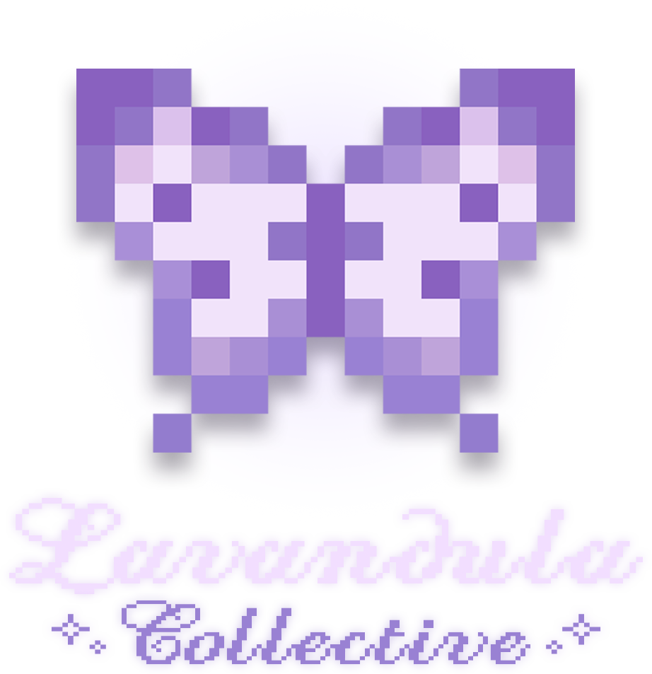

# Home

<figure><figcaption></figcaption></figure>

<h4 align="center"><em>Crafting worlds worth coming home to.</em></h4>

<a href="https://app.gitbook.com/o/su6DYrYGIoNVvHpiBlzo/s/VAqd8KuLEIUsMxWajGvY/" class="button primary" data-icon="box-isometric-tape">See Projects</a><a href="https://app.gitbook.com/o/su6DYrYGIoNVvHpiBlzo/s/Ps3HEspLtmNd5qRF51jU/" class="button secondary" data-icon="book-heart">Documentation</a><a href="license.md" class="button secondary" data-icon="copyright">License</a>

Explore our Minecraft mods, modpacks, and more!

